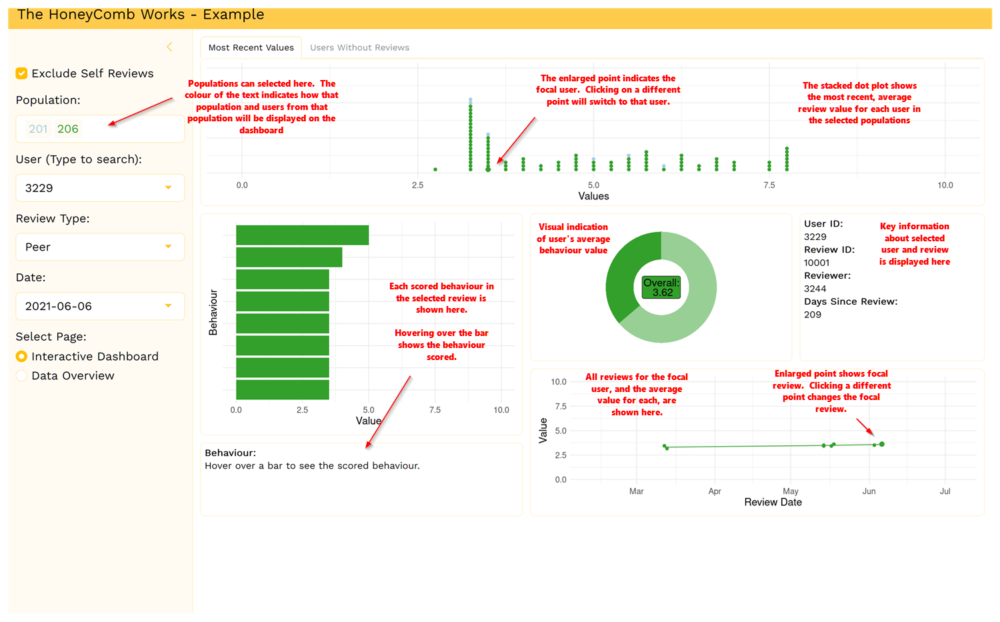
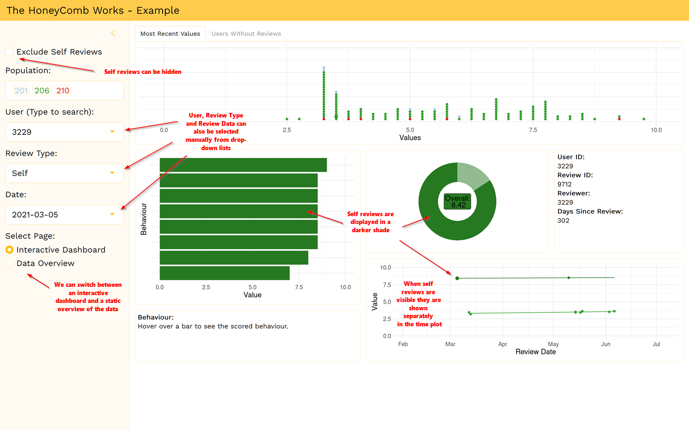
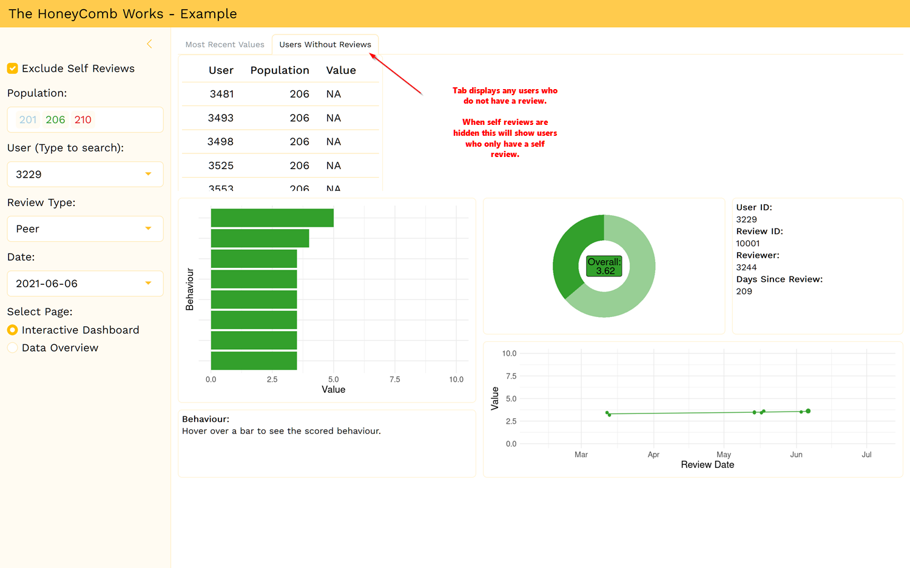
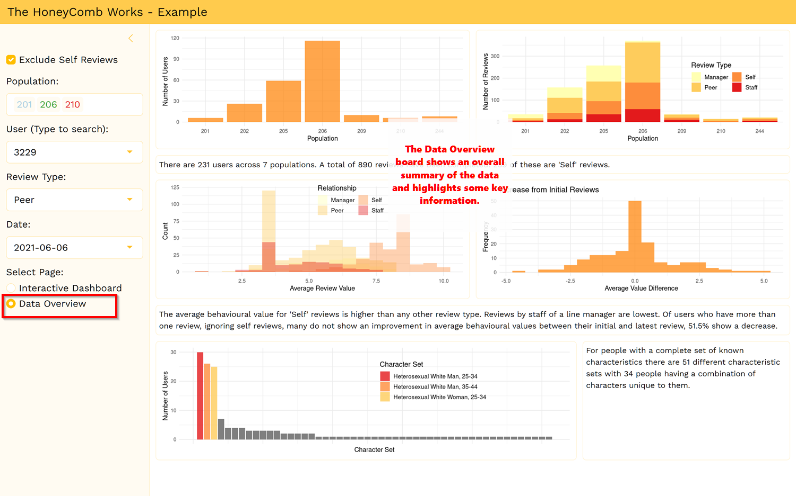

# 🌟 The Honeycomb Works - Assessment Dashboard

## Overview

Welcome to the **HoneyComb Works Assessment Dashboard**! This interactive web application is designed to facilitate the evaluation and analysis of performance reviews. Users can filter and visualise data based on various criteria, providing valuable insights into review types, user roles, and review dates.

This dashboard serves as an example for handling behavioural review data collected by The Honeycomb Works. While the GitHub deployment may experience some lag, the ShinyApps deployment is much faster. Running the app locally is even quicker, and it is a self-contained file (note that you may need to change the data source to the URL at the top of `app.R`).

### 🌐 Live Links
- **Live App:** [ShinyApps](https://simplydch.shinyapps.io/thcworks_assessement/)
- **GitHub Repository:** [GitHub](https://simplydch.github.io/thcworks_assessment/)

---

## Features

- **🔍 Dynamic Filtering:** Filter data by population, user type, review type, and date.
- **📊 Interactive Dashboard:** Visualise data through an engaging interface.
- **📈 Data Overview:** Access a comprehensive overview of the dataset.

---

## Answers to Assessment Questions

### Design Choices
**Layout:**  
For the layout, I opted for a clean, intuitive design that allows users to easily navigate the dashboard. Key information is easily accessible and interpretable. Filtering should be a seamless process and readily available. Visualisations are simple and provide a clear overview of the data.

**Interactivity:**  
Interactivity is a core feature of the dashboard. Users can dynamically filter data based on various criteria such as user roles, review types, and dates, and they can interact with the plots to select visually interesting points. Additionally, hover effects provide contextual information without cluttering the interface.

**Maintainability:**  
To ensure maintainability, the code is well-structured and formatted consistently. Functions are clearly defined for specific tasks, making it easier to update or extend functionality in the future. The input dataset is initially processed to ensure it is valid and correctly structured for the app. I also included comments to assist future developers in understanding the codebase. CSS is used to consistently style components, making changes simple to implement. Additionally, relevant variables that are used repeatedly are set up early in the code.

**Improvements:**  
The app is overly reactive, which causes it to lag. I need more time to reduce reactivity in multiple components while maintaining functionality. I suspect the code also contains redundancies, but I would need longer to familiarise myself with R Shiny to fully streamline the app.

---

### Extensions
To enhance the dashboard further, I would consider adding the following insights or charts:

1. **Trend Analysis:** Time series charts to visualise trends in reviews over time and within populations would help establish if any implemented strategies are successful.
2. **Reviewers and Users:** More detailed comparisons between reviewers, users, and scores given would likely provide unique insights, but the dataset may not be large enough to draw any conclusive findings.
3. **Demographic Breakdown:** Charts that segment data by demographics (e.g., age, ethnicity) to uncover insights related to specific groups within the organisation might be beneficial, but intersectionality should also be considered.


---

### Clarifying Stakeholder Needs
Before comparing self vs. peer reviews, I would ask the following questions to clarify stakeholder needs:

1. **Purpose of Comparison:** What specific insights are you hoping to gain from self and peer reviews? Are you interested in an individual's self-awareness, or just how they view themselves?
2. **Focal Behaviours:** Are there specific competencies or behaviours that are most important to focus on when reviews are carried out by a peer compared to the individual?
3. **Actionable Outcomes:** What actions do you expect to take based on the comparison results? How will this information be used to support employee development or performance management?

---

## Technologies Used

- [R](https://www.r-project.org/) - A programming language for statistical computing.
- [Shiny](https://shiny.posit.co/) - A web application framework for R.
- [bslib](https://rstudio.github.io/bslib/) - A package for creating Bootstrap themes in R.
- [ggplot2](https://ggplot2.tidyverse.org/) - A system for declaratively creating graphics.

---

## Screenshots

### Dashboard Interface

 
 
 
 

---

## To Run the App Locally

Follow these steps to get the app running on your local machine:

1. **Clone the repository:**
    ```bash
    git clone https://github.com/your-username/thcworks_assessment.git
    cd thcworks_assessment
    ```

2. **Install required packages:**
    ```r
    install.packages(c("shiny", "bslib", "RColorBrewer", "ggplot2"))
    ```

3. **Run the app:**
    ```r
    shiny::runApp()
    ```

---

## Contact

For questions, suggestions, or support, feel free to reach out:

**Developer:** DCH  
📧 Email: [simplydch@gmx.co.uk]  

---
